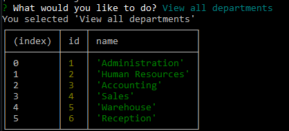
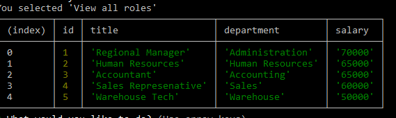
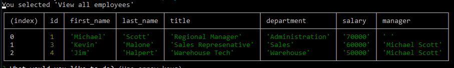
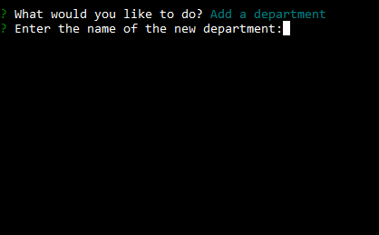
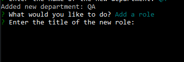
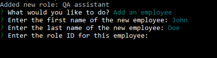

# Employee Tracker

The Employee Tracker is a command-line application designed to manage a company's employee database. This project allows business owners and managers to effortlessly organize and track the various departments, roles, and employees within their organization.

Built using Node.js, Inquirer, and PostgreSQL, this project serves as a practical demonstration of my newly acquired PostgreSQL skills. By developing this application, I have gained hands-on experience in creating and managing relational databases, writing SQL queries, and integrating PostgreSQL with Node.js.

Walk through example: https://youtu.be/DQIudNls7yM

## Table of Contents 

- [Installation](#installation)
- [Usage](#usage)
- [Credits](#credits)
- [License](#license)

## Installation

Make sure to install: 

* PostgreSQL

Start by cloning this repository to your local machine. 
Then navigate to, and open the project directory
Install dependencies by running 'npm i'
Navigate to the schema.sql file and create your own database, if desired.
Lastly, find the .env file and update it with your postgreSQL credentials

## Usage

To use this project, begin by running the application with the command node index.js. Follow the on-screen prompts to view departments, roles, and employees, or to add and update entries in the database. When you're finished, simply select the "Exit" option to close the application.

## Features 

View All Departments

View All Roles

View All Employees

Add a Department

Add a Role

Add an Employee

## Contact Me

## Contact Me

| Name           | Email               | GitHub               | LinkedIn              |
|----------------|---------------------|----------------------|-----------------------|
| Mekenna Baker      | [Email](mailto:mekenna.drabner@gmail.com) | [GitHub](https://github.com/Mekenna-Baker) | [LinkedIn](https://www.linkedin.com/in/mekenna--baker/) |

